# Agentix Trading Platform

> _"Autonomous crypto trading across multiple sectors and orbs"_

An AI-powered trading platform designed to autonomously manage and execute trading strategies across multiple sectors and orbs. Agentix leverages rule-based trading strategies with advanced AI decision-making, event-driven architecture, and a modular design to provide users with a comprehensive trading solution.

---

## 🎯 Key Features

1. **Smart Visual Backtester** - Verify deployable rule-based trading strategies
2. **Autonomous Agent** - Monitor and discretionarily deploy user strategies
3. **Dynamic Threads** - Plug-in external financial facilitators into Agentix
4. **Simplified Tradespace** - Organized into Sectors, Orbs, Threads, Pairs, and Assets

---

## 📐 Architecture

### Tradespace Hierarchy

```
Tradespace → Sectors → Orbs → Pairs → Assets
                        └─→ Threads (financial facilitators / Network Infrastructure)
```

### Core Concepts

**Sector** - Trading environment where agents operate

- Examples: "Live Trading Sector", "Paper Trading Sector", "Polygon-Only Sector"

**Orb** - Asset collection within a specific network/venue

- Examples: "Ethereum DeFi Orb", "Polygon Meme Orb", "cTrader Forex Orb"

**Threads** - Plug-ins of financial facilitators (agent-controlled)

- Swaps, bridges, or internal liquidity connecting different orbs
- Allows agents to move value between orbs within a sector
- Can be a network infrastructure thread for paper trading simulators

**Pairs** - Tradeable pairs within an orb

- Examples: ETH/USDC, POL/USDT, EUR/USD

**Assets** - Individual tokens/currencies

- Examples: ETH, USDC, POL, EUR

---

## 🏗️ Architectural Blueprint: Event-Driven, Composable Trading Agent

The architecture is designed to be modular and event-driven, allowing for easy expansion and integration of new features.

```mermaid
flowchart TB
    %% User Interface Layer
    USER[👤 User] --> UI[📱 Next.js UI]

    %% Core Application Flow
    UI -->|"Manages Sectors/Orbs"| SERVER[🖥️ Express Server ✅]

    %% Event-Driven Trading Loop (The Heart)
    SERVER -->|"Bootstraps"| CRON[⏰ Cron Service 📋]
    CRON -->|"Schedules User Jobs"| POLICY_QUEUE[📋 User Policy Queue 📋]

    %% AI Decision Making
    POLICY_QUEUE -->|"Triggers Analysis"| AI_AGENT[🤖 AI Agent 🚧]
    AI_AGENT -->|"Market Analysis"| TOOLS[🔧 Insight/Execution Tools ✅]
    TOOLS -->|"Data"| AI_AGENT

    %% Trade Execution Branch
    AI_AGENT -->|"Creates Trade + Rules"| DATABASE[(💾 Database ✅)]
    AI_AGENT -->|"Spawns Monitor Job"| RISK_QUEUE[⚠️ Strategy & Risk Queue 📋]

    %% Continuous Trade Monitoring Loop
    RISK_QUEUE -->|"Every 20s: Check Rules"| MONITOR[📊 Trade Monitor 📋]
    MONITOR -->|"Fetch Price"| EXTERNAL[🌐 Market APIs ✅]
    MONITOR -->|"Check Exit Rules"| DATABASE
    MONITOR -->|"Close if Triggered"| EXECUTE[⚡ Trade Execution 📋]
    MONITOR -->|"Continue if Not"| RISK_QUEUE

    %% Multi-Chain Trading Infrastructure
    EXECUTE -->|"Via Threads"| CHAINS[⛓️ Multi-Chain DEXs 📋]

    subgraph CHAINS[⛓️ Multi-Chain Infrastructure 📋]
        ETH[🔷 Ethereum - Uniswap]
        SOL[🟣 Solana - Jupiter]
        POLY[🟪 Polygon - DEXs]
        AVAX[🔺 Avalanche - DEXs]
        BRIDGES[🌉 Cross-Chain Bridges]
    end

    %% Data Persistence
    DATABASE -->|"Stores"| DATA_STRUCTURE[📊 Hierarchical Data]

    subgraph DATA_STRUCTURE[📊 Trading Hierarchy ✅]
        direction TB
        USERS[👥 Users] --> SECTORS[🏢 Sectors]
        SECTORS --> ORBS[🌐 Orbs]
        ORBS --> PAIRS[💱 Trading Pairs]
        ORBS --> THREADS[🧵 Cross-Chain Threads]
    end

    %% Wallet Management
    SERVER -->|"Generates"| WALLETS[💳 Privy Wallets 📋]
    WALLETS -->|"Per Orb"| ORBS

    %% Queue Infrastructure
    POLICY_QUEUE -.->|"Redis"| REDIS[(🔴 Redis ✅)]
    RISK_QUEUE -.->|"BullMQ"| REDIS

    %% Status Indicators
    AI_AGENT -.->|"🚧 NEXT: Update for Sector/Orb Context"| STATUS1[Context Building 📋]
    RISK_QUEUE -.->|"📋 NEXT: Implement Queue Workers"| STATUS2[Queue Implementation 📋]
    UI -.->|"📋 NEXT: Build Sector/Orb Management"| STATUS3[UI Components 📋]

    %% Styling
    classDef completed fill:#4ade80,stroke:#16a34a,stroke-width:3px,color:#ffffff
    classDef inProgress fill:#f59e0b,stroke:#d97706,stroke-width:3px,color:#ffffff
    classDef notStarted fill:#ef4444,stroke:#dc2626,stroke-width:3px,color:#ffffff
    classDef infrastructure fill:#6366f1,stroke:#4f46e5,stroke-width:2px,color:#ffffff

    class SERVER,DATABASE,DATA_STRUCTURE,TOOLS,EXTERNAL,REDIS completed
    class AI_AGENT inProgress
    class CRON,POLICY_QUEUE,RISK_QUEUE,MONITOR,EXECUTE,CHAINS,WALLETS,STATUS1,STATUS2,STATUS3 notStarted
    class USER,UI,REDIS infrastructure
```



---

## 🤝 Contributing

- [ ] Research fast dynamic asset registries
