```mermaid
flowchart TB
    %% User Interface Layer
    USER[👤 User] --> UI[📱 Next.js UI]

    %% Core Application Flow
    UI -->|"Manages Sectors/Orbs"| SERVER[🖥️ Express Server ✅]

    %% Event-Driven Trading Loop (The Heart)
    SERVER -->|"Bootstraps"| CRON[⏰ Cron Service 📋]
    CRON -->|"Schedules User Jobs"| POLICY_QUEUE[📋 User Policy Queue 📋]

    %% AI Decision Making
    POLICY_QUEUE -->|"Triggers Analysis"| AI_AGENT[🤖 AI Agent 🚧]
    AI_AGENT -->|"Market Analysis"| TOOLS[🔧 Insight/Execution Tools ✅]
    TOOLS -->|"Data"| AI_AGENT

    %% Trade Execution Branch
    AI_AGENT -->|"Creates Trade + Rules"| DATABASE[(💾 Database ✅)]
    AI_AGENT -->|"Spawns Monitor Job"| RISK_QUEUE[⚠️ Strategy & Risk Queue 📋]

    %% Continuous Trade Monitoring Loop
    RISK_QUEUE -->|"Every 20s: Check Rules"| MONITOR[📊 Trade Monitor 📋]
    MONITOR -->|"Fetch Price"| EXTERNAL[🌐 Market APIs ✅]
    MONITOR -->|"Check Exit Rules"| DATABASE
    MONITOR -->|"Close if Triggered"| EXECUTE[⚡ Trade Execution 📋]
    MONITOR -->|"Continue if Not"| RISK_QUEUE

    %% Multi-Chain Trading Infrastructure
    EXECUTE -->|"Via Threads"| CHAINS[⛓️ Multi-Chain DEXs 📋]

    subgraph CHAINS[⛓️ Multi-Chain Infrastructure 📋]
        ETH[🔷 Ethereum - Uniswap]
        SOL[🟣 Solana - Jupiter]
        POLY[🟪 Polygon - DEXs]
        AVAX[🔺 Avalanche - DEXs]
        BRIDGES[🌉 Cross-Chain Bridges]
    end

    %% Data Persistence
    DATABASE -->|"Stores"| DATA_STRUCTURE[📊 Hierarchical Data]

    subgraph DATA_STRUCTURE[📊 Trading Hierarchy ✅]
        direction TB
        USERS[👥 Users] --> SECTORS[🏢 Sectors]
        SECTORS --> ORBS[🌐 Orbs]
        ORBS --> PAIRS[💱 Trading Pairs]
        ORBS --> THREADS[🧵 Cross-Chain Threads]
    end

    %% Wallet Management
    SERVER -->|"Generates"| WALLETS[💳 Privy Wallets 📋]
    WALLETS -->|"Per Orb"| ORBS

    %% Queue Infrastructure
    POLICY_QUEUE -.->|"Redis"| REDIS[(🔴 Redis ✅)]
    RISK_QUEUE -.->|"BullMQ"| REDIS

    %% Status Indicators
    AI_AGENT -.->|"🚧 NEXT: Update for Sector/Orb Context"| STATUS1[Context Building 📋]
    RISK_QUEUE -.->|"📋 NEXT: Implement Queue Workers"| STATUS2[Queue Implementation 📋]
    UI -.->|"📋 NEXT: Build Sector/Orb Management"| STATUS3[UI Components 📋]

    %% Styling
    classDef completed fill:#4ade80,stroke:#16a34a,stroke-width:3px,color:#ffffff
    classDef inProgress fill:#f59e0b,stroke:#d97706,stroke-width:3px,color:#ffffff
    classDef notStarted fill:#ef4444,stroke:#dc2626,stroke-width:3px,color:#ffffff
    classDef infrastructure fill:#6366f1,stroke:#4f46e5,stroke-width:2px,color:#ffffff

    class SERVER,DATABASE,DATA_STRUCTURE,TOOLS,EXTERNAL,REDIS completed
    class AI_AGENT inProgress
    class CRON,POLICY_QUEUE,RISK_QUEUE,MONITOR,EXECUTE,CHAINS,WALLETS,STATUS1,STATUS2,STATUS3 notStarted
    class USER,UI,REDIS infrastructure
```

# Agentix Trading Platform
## AI-Powered Multi-Sector Trading System

> *"Autonomous crypto trading across multiple sectors and orbs"*

## 🔄 System Flow Architecture

## 🏗️ Architectural Blueprint: Event-Driven, Composable Trading Agent

### **Core Philosophy: Decoupled Risk and Strategy**

The system's architecture is founded on a sophisticated principle: **the complete separation of universal risk management from dynamic, alpha-seeking strategy logic.**

*   **Risk Layer (The Foundation):** Every trade initiated by the AI Agent is fundamentally governed by a non-negotiable risk layer, consisting of Stop Loss (SL) and Take Profit (TP) parameters. This is the default safety net that ensures capital is always protected.
*   **Strategy Layer (The Overlay):** The AI Agent can then compose and attach one or more advanced, alpha-seeking strategies to an open trade (e.g., RSI-based exit, moving average cross). These strategies provide more nuanced exit conditions that can optimize profits or preempt losses before the foundational SL/TP levels are hit.

A trade is closed by whichever condition is met first, be it the foundational risk layer or an overlayed strategy. This composable, layered approach provides ultimate flexibility, allowing a trade to operate with simple risk brackets or a complex, multi-condition exit plan.

### **System Workflow and Service Responsibilities**

The system operates as a continuous, cyclical flow orchestrated by two distinct, purpose-driven queues.

#### **1. Cron Service (System Initiator & Heartbeat)** 📋
This service acts as the system's bootstrap and integrity check.
*   **On Startup:** It purges and resets the queues to ensure a clean state.
*   **Continuous Operation:** It periodically scans the system to ensure every active user has a corresponding, repeatable job in the `User Policy Queue`. This guarantees that no user is ever missed and that trading analysis occurs precisely at the frequency defined by their policy.

#### **2. User Policy Queue (Opportunity Discovery)** 📋
This queue's sole purpose is to trigger the **discovery of new trading opportunities.**
*   **Job:** A repeatable job for each user, containing their full trading context (`userId`, `policy`, `positions`, `balances`).
*   **Action:** When a job runs, it invokes the `AI Agent` to perform a holistic market analysis for that specific user.

#### **3. AI Agent (The Central Brain & Orchestrator)** 🚧
This service is the core decision-making engine. It does not manage trades directly but orchestrates their creation and defines their rules.
*   **Analysis:** Upon receiving a user's context, the agent utilizes its suite of tools (`insight-tools`, `execution-tools`) to analyze market data, sentiment, and other factors.
*   **Trade Initiation:** If an opportunity is identified:
    1.  The agent defines the foundational **Risk Layer** (TP and SL).
    2.  It then selects and attaches any optional **Strategy Layer** rules.
    3.  All rules (risk and strategy) are recorded in a `TradeActionsTable` linked to the new trade.
    4.  Finally, it places the trade and creates a **new, unique, repeatable job** in the `Strategy & Risk Queue` to manage this specific open position.
*   **Interrupt Handling:** The agent serves as the single entry point for high-priority user commands (e.g., "force close trade," "update strategy"). This allows a user to override automated logic cleanly and instantly.

#### **4. Strategy & Risk Queue (In-Flight Trade Management)** 📋
This queue's sole purpose is to manage **open, active trades** by executing their predefined exit rules.
*   **Job:** A repeatable job for each open trade, running at a high frequency (e.g., every 20 seconds). The job's payload is simply the `tradeId`.
*   **Execution Cycle:** On each run, the worker performs a lightweight, data-driven check:
    1.  Fetch the `tradeId` from the job.
    2.  Fetch the live market price for the trade's asset.
    3.  Retrieve all active exit rules for the `tradeId` from the database.
    4.  Execute each rule against the live price.
    5.  If **any rule's condition is met**, the worker initiates a "close trade" action and terminates the repeatable job, ending the monitoring cycle.
    6.  If no conditions are met, the job completes and waits for its next scheduled run.

## 🎯 Current Development Priority

**Next Phase: AI Agent System Updates** 🚧
- Context building with sectors/orbs integration
- Tool modifications for cross-orb functionality  
- Trade creation with orb associations

Complete separation of opportunity discovery from active trade management through message queues. Two-queue architecture for user policy execution and strategy monitoring.
